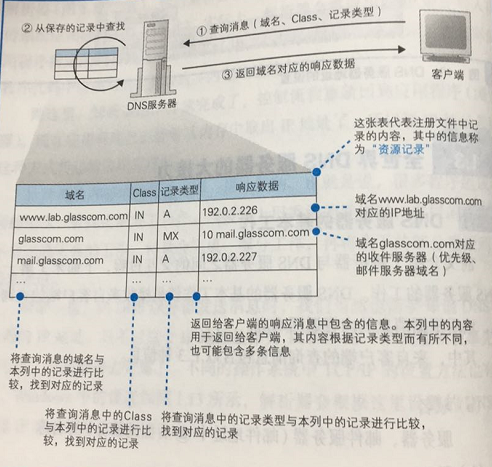
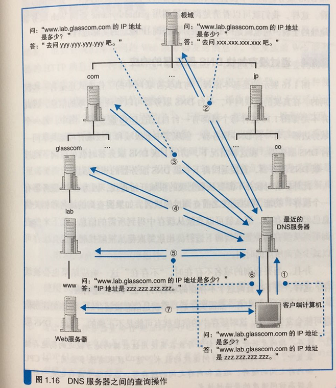
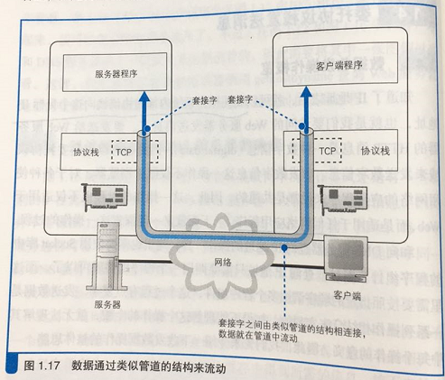

# 引言
本文是《网络是怎样连接的》读书摘要，回答了‘页面从输入URL到页面展示具体发生了什么？’的问题。
# 网络全貌

浏览器与Web服务器之间的交互过程其实很简单，可以概括为：
1. 浏览器向Web服务器发送请求。
2. Web服务器根据请求向浏览器发送响应。

# 第一章 浏览器生成消息

## 生成HTTP请求消息

当你输入一个地址后浏览器的第一步工作就是解析url。解析的作用就是要搞清楚你要去哪（哪个服务器），干什么（获取什么资源，提交什么数据）。

解析完成后,浏览器根据解析的结果，生成HTTP请求。
* 请求消息的第一行为请求行，里面重点是请求方法，这个根据场景来确定。比如地址栏中输入网址，点击超链接场景中使用的是GET方法。而对于表单提交有可能是POST请求。现实开发过程还有其他很多方法，（delete,put,option）根据需求来自定义的。路径可以从url中提取然后原封不动地写上去，最后再加上HTTP的版本号（HTTP1.1）。
* 请求消息的第二行为消息头，用来存放更多有关请求消息的信息。比如常见的Cache-control,Refer,Accept,Host,If-None-Match...
* 最后消息体，对于GET请求来说通过URI和方法Web服务器就能知道要干嘛，所以可以为空。消息体结束后，整个请求消息也就结束了。
请求消息发出去后，web服务器会给出响应，具体在第六章讲解。

## 向DNS服务器查询Web服务器的IP地址

在公司中（互联网）你可以通过人名（域名）找到对应的人（web服务器），但是会有重名的情况，你就不知道找谁了（请求就出错了）。此时你就要通过唯一的工号就能找到对应的人，在互联网中工号就是IP。（当然IP也有可能重，比如不同局域网中）。

相对于域名，IP的字节数少，计算机搜索效率高。但对于一串数字而言，域名更方便人记忆。所以采用人记域名，机器使用IP，将域名转化为IP的就是DNS（域名服务器）。
通过DNS查询IP的过程，就叫域名解析，负责执行解析的就是解析器。解析器其实就是Scoket库（网络开发中的一种标准库，提供给其他应用程序调用操作系统网络功能的程序组件）中的程序组件。具体过程如下

对于DNS的IP地址是不需要设置的。是操作系统中预先设置好的。

以上我们知道了，通过DNS我们可以知道当前域名的IP地址，但是我们是通过传给DNS的查询信息又是什么呢？

## 全世界DNS服务器大接力

### DNS的基本工作

由上图我们可以看到查询信息包括域名（服务器，邮件服务器-@后面的部分），Class（早期不只互联网这一种网络，Class用来区分不同网络，现在的话只剩互联网了只有一个值IN），记录类型（A-Address,MX-Mail eXchange .etc）,根据这三个信息DNS就可以从域名与IP地址的对照表中查找相应的记录，并返回IP。

但是全世界有那么多的域名，保存在一台DNS一台DNS服务器上可定时不可能的，那就需要多个DNS配合工作来返回对用的IP。

首先要了解两个基本知识。
1. 域名的层次结构：www.lab.glasscom.com，域名用句点来分割的，越靠右表示层级越高，把前面的域名类比到公司层级就是‘com集团glasscom部门lab科的www’。每一个层级都会注册到一个DNS服务器上，（当然多个域也可以放到一个DNS上，这边为了方便理解假设一个DNS只存放一个域的信息）
2. 根域：域名在查找过程中不可能挨个去查询。而是采用：每个DNS的IP都会注册到他的上级域名中，一直到根域（管理com，cn这样顶级域名DNS服务启的地址），然后将DNS的根域的地址保存到每个DNS中。关于根域全世界只有13个，而且地址基本不变，每个DNS保存根域不难。

查找到结果之后，不管是IP还是未找到，都会保存（缓存）到你的最近的DNS上，以便下次访问。

### 委托协议栈发送消息

当查到IP之后就可以委托操作系统内部的协议栈把请求发出去了，同样跟查询IP调用scoket中的组件一样，发请求也就是依次调用scoket中的组件。

分为4个阶段：
1. 创建套接字（创建套接字阶段）
2. 将管道连接到服务器端的套接字上（连接阶段）
3. 收发数据（通信阶段）
4. 断开管道并删除套接字（断开阶段）

当然每个过程都会有很多技术，比如套接字是怎么匹配，断开过程这样的。

# 电信号传输TCP/IP数据
TCP/IP、套接字、协议栈、IP地址、端口号、包、头部、网卡、网卡驱动、MAC地址、以太网控制器、ICMP、UDP
# 从网线到网络设备
局域网、双绞线、串扰、中继式集线器、MDI、MDI-X、交换式集线器、全双工、半双工、自动协商、路由器、路由表、子网掩码、默认网关，分片、地址转换、共有地址、私有地址
# 通过接入网进入互联网内部
光纤、接入网、宽带接入服务器、远程接入服务器...
# 服务端的局域网中有什么玄机
防火墙、包过滤、数据中心、轮询、负载均衡器、代理、代理服务器、内容分发服务、重定向
# 请求到达Web服务器，响应返回浏览器
响应消息、多任务、多进程、虚拟目录、CGI、访问控制、密码、数据格式、MIME