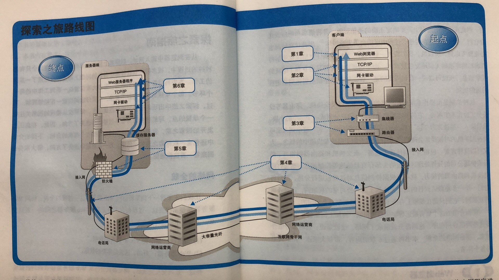

# 引言
本文是《网络是怎样连接的》读书摘要，回答了‘页面从输入URL到页面展示具体发生了什么？’的问题。
# 网络全貌

浏览器与Web服务器之间的交互过程其实很简单，可以概括为：
1. 浏览器向Web服务器发送请求。
2. Web服务器根据请求向浏览器发送响应。
# 第一章 浏览器生成消息
## 生成HTTP请求消息
当你输入一个地址后浏览器的第一步工作就是解析url。解析的作用就是要搞清楚你要去哪（哪个服务器），干什么（获取什么资源，提交什么数据）。

解析完成后,浏览器根据解析的结果，生成HTTP请求。
* 请求消息的第一行为请求行，里面重点是请求方法，这个根据场景来确定。比如地址栏中输入网址，点击超链接场景中使用的是GET方法。而对于表单提交有可能是POST请求。现实开发过程还有其他很多方法，（delete,put,option）根据需求来自定义的。路径可以从url中提取然后原封不动地写上去，最后再加上HTTP的版本号（HTTP1.1）。
* 请求消息的第二行为消息头，用来存放更多有关请求消息的信息。比如常见的Cache-control,Refer,Accept,Host,If-None-Match...
* 最后消息体，对于GET请求来说通过URI和方法Web服务器就能知道要干嘛，所以可以为空。消息体结束后，整个请求消息也就结束了。
请求消息发出去后，web服务器会给出响应，具体在第六章讲解。

## 向DNS服务器查询Web服务器的IP地址
在公司中（互联网）你可以通过人名（域名）找到对应的人（web服务器），但是会有重名的情况，你就不知道找谁了（请求就出错了）。此时你就要通过唯一的工号就能找到对应的人，在互联网中工号就是IP。（当然IP也有可能重，比如不同局域网中）。

相对于域名，IP的字节数少，计算机搜索效率高。但对于一串数字而言，域名更方便人记忆。所以采用人记域名，机器使用IP，将域名转化为IP的就是DNS（域名服务器）。
通过DNS查询IP的过程，就叫域名解析，负责执行解析的就是解析器。解析器其实就是Scoket库（网络开发中的一种标准库，提供给其他应用程序调用操作系统网络功能的程序组件）中的程序组件。具体过程如下

对于DNS的IP地址是不需要设置的。是操作系统中预先设置好的。

# 全世界DNS服务器大接力
## DNS副武器的基本工作

# 委托协议栈发送消息